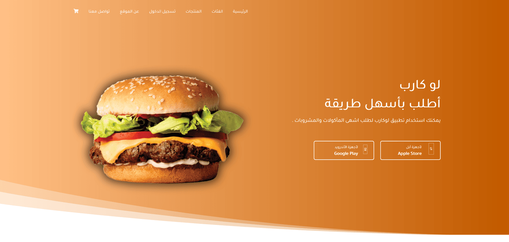
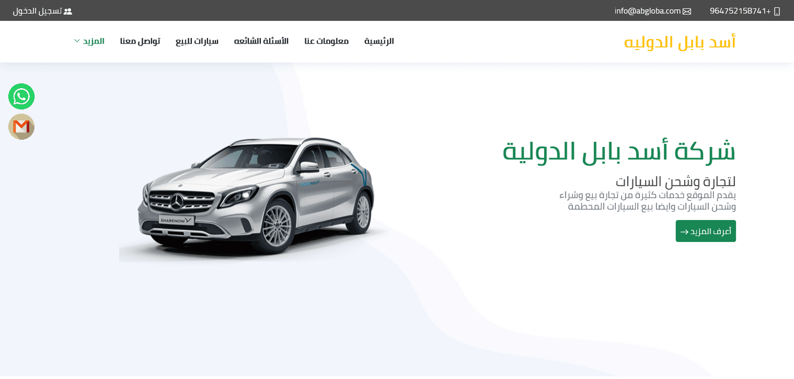
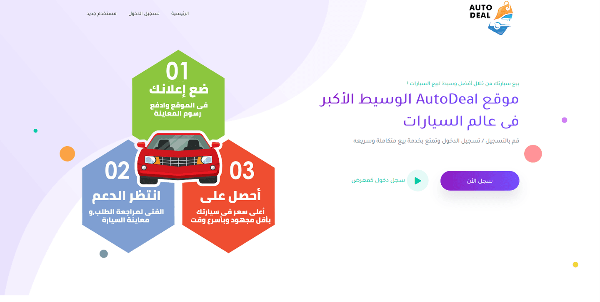

<!DOCTYPE html>
<html lang="en">
    
<!-- Mirrored from retrina.com/demo/nill/mono-01.html by HTTrack Website Copier/3.x [XR&CO'2014], Thu, 20 May 2021 19:50:09 GMT -->
<head>
        <meta charset="UTF-8">
        <meta name="viewport" content="width=device-width, initial-scale=1, shrink-to-fit=no">
        <title>Ahmed Hegazy | Back End Developer</title>
        <meta name="description" content="Back End Web developer with good skills in web designing and developing and seeking for a back end web developer job with good knowledge in computer science" />
        <meta name="keywords" content="freelancer,Web,developer,laravel,vuejs,job,backend developer,frontend developer,vuejs,resume,it" />
        <meta name="author" content="Ahmed Heagzy" />

        <!--  FavIcon  -->
        <link rel="shortcut icon" href="assets/img/favicon.icod">

        <!-- Google Fonts -->
		<link href="https://fonts.googleapis.com/css?family=Muli:400,600" rel="stylesheet">
		<link href="https://fonts.googleapis.com/css?family=Poppins:400,500,600,700" rel="stylesheet">

        <!--  plugins Css  -->
        <link rel="stylesheet" type="text/css" href="assets/css/plugins.css">
        <!--  Custom Style CSS  -->
        <link rel="stylesheet" href="assets/css/style.css">

    </head>
    <body class="pilling-page mono"  data-spy="scroll" data-target="#scrollspy" data-offset="1">

        <!--  Pre Loader  -->
        

            
        

           <!-- Blog Single Modal -->
           

            

                

                    

                        <h5 class="modal-title" id="blogModalScrollable">Write Your Dreams</h5>
                        <button type="button" class="close text-muted" data-dismiss="modal" aria-label="Close">
                            &times;
                        </button>
                    

                    

                        <!--   Blog-single   Start -->
                        

                            

                                

                                    

                                        

                                            

                                                <h4 class="mb-4">The best way to become a good web designer</h4>
                                                
                                                 1 April 2019
                                        / By  John Doe. 
                                        
                                                
These words are here to provide the reader with a basic impression of how actual text will appear in its final presentation. This is dummy copy. It is not meant to be read. It has been placed here solely to demonstrate the look and feel of finished, typeset text. These words are here to provide the reader with a basic impression of how actual text will appear in its final presentation. Only for show.

                                                

                                                    <i class="base-color lni-quotation size-md"></i>
                                                    <h6 class="base-color font-italic mb-0">We Love Buna, lorem ipsum dolor sit amet, consectetur adipiscing elit. Vestibulum id ligula felis euismod semper.</h6>
                                                

                                                
These words are here to provide the reader with a basic impression of how actual text will appear in its final presentation. This is dummy copy. It is not meant to be read. It has been placed here solely to demonstrate the look and feel of finished, typeset text. These words are here to provide the reader with a basic impression of how actual text will appear in its final presentation. Only for show.

                                                <ul class="list-unstyled mt-4 checkmark-list">
                                                    <!-- Item-01 -->
                                                    <li class="mb-2">
                                                        The purpose of lorem ipsum is to create
                                                    </li>
                                                    <!-- Item-02 -->
                                                    <li class="mb-2">
                                                        In particular, the garbled words of lorem ipsum
                                                    </li>
                                                    <!-- Item-03 -->
                                                    <li class="mb-2">
                                                        occasionally circumstances occur in which toil
                                                    </li>
                                                </ul>

                                                <!--Blog Reply-->
                                                

                                                    

                                                        <h2 class="text-left mb-4">Leave a reply</h2>
                                                        <form>
                                                            

                                                                

                                                                    

                                                                        <input name="name" id="blog-name" type="text" class="form-control" placeholder="Your Name*" required>
                                                                    

                                                                

                                                                

                                                                    

                                                                        <input name="email" id="blog-email" type="email" class="form-control" placeholder="Your Email*" required>
                                                                    

                                                                

                                                                

                                                                    

                                                                        <textarea name="comments" id="blog-comments" rows="4" class="form-control" placeholder="Your message..."></textarea>
                                                                    

                                                                

                                                                

                                                                    <button type="submit" class="pill-button" id="blog-submit-btn">Submit</button>
                                                                

                                                            

                                                        </form>
                                                    

                                                

                                            

                                        

                                    

                                

                            

                        

                        <!--   Blog-Single End  -->
                    

                

            

        

        <!-- Portfolio Single Modal -->
        

            

                

                    

                        <h5 class="modal-title" id="portfolioModalScrollable">My Work</h5>
                        <button type="button" class="close text-muted" data-dismiss="modal" aria-label="Close">
                            &times;
                        </button>
                    

                    

                        

                            

                                

                                    

                                        

                                            <h2 class="text-dark mb-3">Single  Portfolio</h2>
                                            
In a professional context it often happens that private clients corder a publication to be made.

                                        

                                        

                                            

                                                

                                                    

                                                        <h6>Created by:</h6>
                                                        
John Doe

                                                    

                                                

                                            

                                            

                                                

                                                    

                                                        <h6 class="contact_detail-title">Completed on:</h6>
                                                        
September 30, 2019

                                                    

                                                

                                            

                                            

                                                

                                                    

                                                        <h6>Skills:</h6>
                                                        
HTML5 / PHP / CSS3

                                                    

                                                

                                            

                                        

                                        

                                            

                                                
                                            

                                        

                                        

                                            
These words are here to provide the reader with a basic impression of how actual text will appear in its final presentation. This is dummy copy. It is not meant to be read. It has been placed here solely to demonstrate the look and feel of finished, typeset text. These words are here to provide the reader with a basic impression of how actual text will appear in its final presentation. Only for show.

                                            
These words are here to provide the reader with a basic impression of how actual text will appear in its final presentation. This is dummy copy. It is not meant to be read. It has been placed here solely to demonstrate the look and feel of finished, typeset text. These words are here to provide the reader with a basic impression of how actual text will appear in its final presentation. Only for show.

                                        

                                    

                                

                            

                        

                    

                

            

        

        <!--  Page Pilling  Strat  -->
		 

             <!--   Header Start -->
             <header>
                 

                     <a href="index.html" class="logo">
                         AhmedHegazy
                     </a>
                 

                 

                    
                    <!--    Overlay Menu Start    -->
                    

                        <!-- Overlay Menu -->
                        

                            

                                

                                    

                                        <ul class="list-group text-left" id="myMenu">
                                            <li data-menuanchor="hero" class="list-group-item"><a href="#hero">Home</a></li>
                                            <li data-menuanchor="about" class="list-group-item"><a href="#about">About me</a></li>
                                            <li data-menuanchor="services" class="list-group-item"><a href="#services">Services</a></li>
                                            <li data-menuanchor="portfolio" class="list-group-item"><a href="#portfolio">Portfolio</a></li>
                                            <li data-menuanchor="client" class="list-group-item"><a href="#testimonial">Client</a></li>
                                        </ul>
                                        <ul class="list-group contact-info text-left mb-0">
                                            <li class="list-group-item">Contact Info :</li>
                                            <li class="list-group-item"><i class="lni-map-marker"></i>Jehyna, Sohag , Egypt</li>
                                            <li class="list-group-item"><i class="lni-phone-handset"></i> 00201069422021</li>
                                            <li class="list-group-item"><i class="lni-envelope"></i>
                                                <a href="mailto:ahmedhegazi214@gmail.com" style="font-size: 12px" class="__cf_email__" data-cfemail="a0cec9cccce0d2c5d4d2c9cec18ec3cfcd">
                                                    ahmedhegazi214@gmail.com
                                                </a></li>
                                            <li class="list-group-item">Follow me :</li>
                                            <li class="list-group-item">
                                                <ul class="list-inline socails">
                                                <li class="list-inline-item"><a href="https://www.facebook.com/AhmedMohHegazi"><i class="lni-facebook-filled"></i></a></li>
                                                <li class="list-inline-item"><a href="https://twitter.com/ahmedhegezi"><i class="lni-twitter-filled"></i></a></li>
                                                <li class="list-inline-item"><a href="https://github.com/eng-ahmedhegazy"><i class="lni-github-original"></i></a></li>
                                                <li class="list-inline-item"><a href="https://www.linkedin.com/in/ahmedhegazi214/"><i class="lni-linkedin-original"></i></a></li>
                                            </ul>
                                            </li>
                                        </ul>
                                    

                                

                            

                        

                    

                    <!--    Overlay Menu End    -->
                 

             </header>
             <!--   Header End   -->
            <!--    Hero Start    -->
            <section class="section pp-scrollable hero hero-01" id="hero" data-navigation-color="#fff" data-navigation-tooltip="HOME" data-background-image="assets/img/nill.jpg">
                

                    

                        

                            

                                
Home

                            

                            

                                

                                    

                                        <h1 class="text-dark mb-3">I'M Ahmed Hegazy</h1>
                                        <h4 class="text-dark text-capitalize mb-0">A   </h4>
                                        

                                            Back End Web developer with good
                                            skills in web designing and developing
                                            and seeking for a back end web
                                            developer job with good knowledge
                                            in computer science.

                                        

                                            <ul class="list-inline social-icon mt-2">
                                                <li class="list-inline-item"><a href="https://www.facebook.com/AhmedMohHegazi"><i class="lni-facebook-filled text-dark"></i></a></li>
                                                <li class="list-inline-item"><a href="https://twitter.com/ahmedhegezi"><i class="lni-twitter-filled text-dark"></i></a></li>
                                                <li class="list-inline-item"><a href="https://github.com/eng-ahmedhegazy"><i class="lni-github-original text-dark"></i></a></li>
                                                <li class="list-inline-item"><a href="https://www.linkedin.com/in/ahmedhegazi214/"><i class="lni-linkedin-original text-dark"></i></a></li>
                                            </ul>
                                        

                                    

                                

                            

                        

                    

                

            </section>
            <!--    Hero End    -->

            <!--   About Start   -->
            <section id="about" class="section pp-scrollable about text-dark" data-navigation-color="#fff" data-navigation-tooltip="ABOUT ME">
                

                    

                        

                        

                            

                                
About me

                            

                        

                        

                            

                                
                            

                            

                                <h2 class="text-dark mb-2">About Me</h2>
                                <h5 class="text-dark mb-3">Hello I'M Ahmed Hegazy </h5>
                                

                                    

                                        
Birthday :  4 May 1996

                                        
Phone : 0020 106 942 2021

                                        
Whatsapp : 0020 111 783 5451

                                        
City :  Jehyna, Sohag , Egypt

                                    

                                    

                                        
Age : 25

                                        
Degree : Bachelor

                                        
Mail : <a href="mailto:ahmedhegazi214@gmail.com" class="__cf_email__" data-cfemail="5c3d3e3f1c32353030723f3331">ahmedhegazi214@gmail.com</a>

                                        
Work : Freelance, Part Time, Full Time ,Remotly

                                        
Times Of Work : 8AM - 10PM except Friday

                                    

                                

                                

                                    

                                        <a href="https://download936.mediafire.com/6jqn8redbqng/y0f10ktbx1ovbu4/Resume_Back_End_Developer.pdf" class="pill-button mt-3 mb-lg-0 mr-4">Download Cv</a>
                                        <a href="https://api.whatsapp.com/send?phone=00201069422021" target="_blank" class="pill-button mt-3 mb-lg-0">Send Message</a>
                                    

                                

                            

                        

                        

                            

                                

                                    <!-- Item-01 -->
                                    <!-- Item-02 -->
                                    

                                        

                                            <i class="lni-pencil-alt size-md"></i>
                                        

                                        

                                            10
                                        

                                        
Project Done

                                    

                                    <!-- Item-03 -->
                                    

                                        

                                            <i class="lni-medall size-md"></i>
                                        

                                        

                                            +3 Years
                                        

                                        
Experience

                                    

                                    <!-- Item-04 -->
                                    

                                        

                                            <i class="lni-emoji-smile size-md"></i>
                                        

                                        

                                            6
                                        

                                        
Happy Client

                                    

                                

                            

                        

                    

                    

                

            </section>
            <!--    About End    -->

             <!--   Resume Start   -->
             <section id="resume" class="section pp-scrollable resume" data-navigation-color="#fff" data-navigation-tooltip="RESUME">
                 

                     

                         

                         

                             

                                 
Resume

                             

                             

                                 

                                     <h2 class="text-dark mb-3">My Resume</h2>
                                     
I Am Available For Freelance Projects.

                                 

                             

                         

                         

                             

                                 <h3 class="text-dark mb-2"><i class="lni-graduation base-color"></i>Education</h3>
                                 <ul class="timeline">
                                     <li>
                                         <h6 class="base-color mb-0">Bachelor of Information technology IT department</h6>
                                         <small class="text-muted ">Sept. 2014 – May 2018</small>
                                         

                                             Faculty of computer
                                             and information Assuit University, Assuit, Egypt Cumulative grade:good
                                             (GPA: 2.83)
                                         

                                     </li>
                                     <li>
                                         <h6 class="base-color mb-0">General certificate of secondary education</h6>
                                         <small class="text-muted ">Sept. 2011 – May 2014</small>
                                         

                                             Sqer High School, Jehyana,
                                             Sohag, Egypt).
                                         

                                     </li>
                                 </ul>
                             

                             

                                 <h3 class="text-dark mt-5 mt-lg-0"><i class="lni-pencil base-color"></i>Experience</h3>
                                 <ul class="timeline">
                                     <li>
                                         <h6 class="base-color mb-0">Oracle DBA Intership</h6>
                                         <small class="text-muted ">2019 - 2019</small>
                                         
3-month intensive program, DBA track, Information Technology Institute
                                             (ITI), information system institute (ISI) branch..

                                     </li>
                                     <li>
                                         <h6 class="base-color mb-0"> Backend Developer</h6>
                                         <small class="text-muted ">2018 - Current</small>
                                         
BIS.

                                     </li>
                                     <li>
                                         <h6 class="base-color mb-0"> Backend Developer </h6>
                                         <small class="text-muted ">2019 - 2020</small>
                                         
Wsata Real Estat.

                                     </li>
                                 </ul>
                             

                         

                         

                             

                                 

                                     

                                         
HTML / HTML5

                                         

                                         
95%

                                     

                                     

                                         
CSS / CSS3 / SASS 

                                         

                                         
90%

                                     

                                     

                                         
PHP

                                         

                                         
80%

                                     

                                     

                                         
JQuery

                                         

                                         
80%

                                     

                                     

                                         
Bootstrap

                                         

                                         
85%

                                     

                                 

                             

                             

                                

                                    

                                        
Angular

                                        

                                        
60%

                                    

                                    

                                        
Javascript

                                        

                                        
85%

                                    

                                    

                                        
API

                                        

                                        
80%

                                    

                                    

                                        
Laravel

                                        

                                        
85%

                                    

                                    

                                        
SQL / Oracle Database

                                        

                                        
80%

                                    

                                    

                                        
Photoshop

                                        

                                        
80%

                                    

                                

                            

                         

                     

                     

                 

             </section>
             <!--   Resume End   -->

             <!--   Services Start   -->
             <section id="services" class="section pp-scrollable services" data-navigation-color="#fff" data-navigation-tooltip="SERVICES">
                 

                     

                        

                         

                             

                                 
My Services

                             

                             

                                 

                                     <h2 class="text-dark mb-3">My Services</h2>
                                     
Services I Offer To My Clients

                                 

                             

                         

                         

                             <!-- Item 01 -->
                             

                                 

                                     

                                         <i class="lni-brush-alt size-md base-color"></i>
                                     

                                     

                                         <h5 class="mb-3">User Interface Design</h5>
                                         
Professional UI design.

                                     

                                 

                             

                             <!-- Item 02 -->
                             

                                 

                                     

                                         <i class="lni-check-mark-circle size-md base-color"></i>
                                     

                                     

                                         <h5 class="mb-3">Web Development </h5>
                                         
Develop a Full Website.

                                     

                                 

                             

                             <!-- Item 03 -->
                             

                                 

                                     

                                         <i class="lni-heart size-md base-color"></i>
                                     

                                     

                                         <h5 class="mb-3">Website Support </h5>
                                         
Support Site Against Issues.

                                     

                                 

                             

                             <!-- Item 04 -->
                             

                                 

                                     

                                         <i class="lni-mobile size-md base-color"></i>
                                     

                                     

                                         <h5 class="mb-3">Website Analysis</h5>
                                         
Analysis Websites.

                                     

                                 

                             

                             <!-- Item 05 -->
                         

                     

                     

                 

             </section>
             <!--   Services End   -->

            <!--  Portfolio Start  -->
            <section id="portfolio" class="section pp-scrollable portfolio" data-navigation-color="#fff" data-navigation-tooltip="PORTFOLIO">
                

                    

                        

                        

                            

                                
Portfolio

                            

                            

                                

                                    <h2 class="text-dark">Creative Works</h2>
                                    
Meet My Awesome Works and Enjoy

                                

                            

                        

                        

                            <!--   Portfolio Filters   -->
                            <ul id="portfolio-filter" class="list-unstyled list-inline mb-0 col-lg-12 text-left portfolio-filter">
                                <li class="list-inline-item">
                                    <a href="#" data-filter="*" class="active my-1">Works</a>
                                </li>
                            </ul>
                        

                        

                            <!-- Item 01 -->
                            

                                

                                    
                                    

                                        

                                            

                                                <a href="http://craneriggertest.com/" target="_blank">
                                                    <i class="lni-link"></i>
                                                </a>
                                                <a href="assets/img/portfolio/01.png" class="js-zoom-gallery">
                                                    <i class="lni-search"></i>
                                                </a>
                                            

                                            <h5 class="text-white mt-3 mb-0">Crane Rigger Test</h5>
                                        

                                    

                                

                            

                            

                                

                                    
                                    

                                        

                                            

                                                <a href="#" target="_blank">
                                                    <i class="lni-link"></i>
                                                </a>
                                                <a href="assets/img/portfolio/02.png" class="js-zoom-gallery">
                                                    <i class="lni-search"></i>
                                                </a>
                                            

                                            <h5 class="text-white mt-3 mb-0">Locarb Restaurant Design</h5>
                                        

                                    

                                

                            

                            

                                

                                    
                                    

                                        

                                            

                                                <a href="#" target="_blank">
                                                    <i class="lni-link"></i>
                                                </a>
                                                <a href="assets/img/portfolio/03.png" class="js-zoom-gallery">
                                                    <i class="lni-search"></i>
                                                </a>
                                            

                                            <h5 class="text-white mt-3 mb-0">Old Car Site</h5>
                                        

                                    

                                

                            

                            

                                

                                    
                                    

                                        

                                            

                                                <a href="#" target="_blank">
                                                    <i class="lni-link"></i>
                                                </a>
                                                <a href="assets/img/portfolio/04.png" class="js-zoom-gallery">
                                                    <i class="lni-search"></i>
                                                </a>
                                            

                                            <h5 class="text-white mt-3 mb-0">Al Masa Group</h5>
                                        

                                    

                                

                            

                            

                                

                                    
                                    

                                        

                                            

                                                <a href="#" target="_blank">
                                                    <i class="lni-link"></i>
                                                </a>
                                                <a href="assets/img/portfolio/05.png" class="js-zoom-gallery">
                                                    <i class="lni-search"></i>
                                                </a>
                                            

                                            <h5 class="text-white mt-3 mb-0">Auto Deal Auction Site</h5>
                                        

                                    

                                

                            

                            

                                

                                    
                                    

                                        

                                            

                                                <a href="#" target="_blank">
                                                    <i class="lni-link"></i>
                                                </a>
                                                <a href="assets/img/portfolio/06.png" class="js-zoom-gallery">
                                                    <i class="lni-search"></i>
                                                </a>
                                            

                                            <h5 class="text-white mt-3 mb-0">Detergent Company</h5>
                                        

                                    

                                

                            

                            <!-- Item 02 -->
                           <!--
                            &lt;!&ndash; Item 03 &ndash;&gt;
                            

                                

                                    
                                    

                                        

                                            

                                                <button type="button" data-toggle="modal" data-target="#portfolio-single">
                                                    <i class="lni-link"></i>
                                                </button>
                                                <a href="assets/img/portfolio/003.jpg" class="js-zoom-gallery">
                                                    <i class="lni-search"></i>
                                                </a>
                                            

                                            <h5 class="text-white mt-3 mb-0">My Work</h5>
                                        

                                    

                                

                            

                            &lt;!&ndash; Item 04 &ndash;&gt;
                            

                                

                                    
                                    

                                        

                                            

                                                <button type="button" data-toggle="modal" data-target="#portfolio-single">
                                                    <i class="lni-link"></i>
                                                </button>
                                                <a href="assets/img/portfolio/004.jpg" class="js-zoom-gallery">
                                                    <i class="lni-search"></i>
                                                </a>
                                            

                                            <h5 class="text-white mt-3 mb-0">My Work</h5>
                                        

                                    

                                

                            

                            &lt;!&ndash; Item 05 &ndash;&gt;
                            

                                

                                    
                                    

                                        

                                            

                                                <button type="button" data-toggle="modal" data-target="#portfolio-single">
                                                    <i class="lni-link"></i>
                                                </button>
                                                <a href="assets/img/portfolio/005.jpg" class="js-zoom-gallery">
                                                    <i class="lni-search"></i>
                                                </a>
                                            

                                            <h5 class="text-white mt-3 mb-0">My Work</h5>
                                        

                                    

                                

                            

                            &lt;!&ndash; Item 06 &ndash;&gt;
                            

                                

                                    
                                    

                                        

                                            

                                                <button type="button" data-toggle="modal" data-target="#portfolio-single">
                                                    <i class="lni-link"></i>
                                                </button>
                                                <a href="assets/img/portfolio/007.jpg" class="js-zoom-gallery">
                                                    <i class="lni-search"></i>
                                                </a>
                                            

                                            <h5 class="text-white mt-3 mb-0">My Work</h5>
                                        

                                    

                                

                            

                            &lt;!&ndash; Item 07 &ndash;&gt;
                            

                                

                                    
                                    

                                        

                                            

                                                <button type="button" data-toggle="modal" data-target="#portfolio-single">
                                                    <i class="lni-link"></i>
                                                </button>
                                                <a href="assets/img/portfolio/009.jpg" class="js-zoom-gallery">
                                                    <i class="lni-search"></i>
                                                </a>
                                            

                                            <h5 class="text-white mt-3 mb-0">My Work</h5>
                                        

                                    

                                

                            

                            &lt;!&ndash; Item 08 &ndash;&gt;
                            

                                

                                    
                                    

                                        

                                            

                                                <button type="button" data-toggle="modal" data-target="#portfolio-single">
                                                    <i class="lni-link"></i>
                                                </button>
                                                <a href="assets/img/portfolio/006.jpg" class="js-zoom-gallery">
                                                    <i class="lni-search"></i>
                                                </a>
                                            

                                            <h5 class="text-white mt-3 mb-0">My Work</h5>
                                        

                                    

                                

                            

                            &lt;!&ndash; Item 09 &ndash;&gt;
                            

                                

                                    
                                    

                                        

                                            

                                                <button type="button" data-toggle="modal" data-target="#portfolio-single">
                                                    <i class="lni-link"></i>
                                                </button>
                                                <a href="assets/img/portfolio/008.jpg" class="js-zoom-gallery">
                                                    <i class="lni-search"></i>
                                                </a>
                                            

                                            <h5 class="text-white mt-3 mb-0">My Work</h5>
                                        

                                    

                                

                            
-->
                        

                    

                    

                

            </section>

             

                 

                     

                         

                             
Good Bay

                         

                         

                             
Ahmed Hegazy

                             <ul class="list-inline socails">
                                 <li class="list-inline-item"><a href="https://www.facebook.com/AhmedMohHegazi"><i class="lni-facebook-filled"></i></a></li>
                                 <li class="list-inline-item"><a href="https://twitter.com/ahmedhegezi"><i class="lni-twitter-filled"></i></a></li>
                                 <li class="list-inline-item"><a href="https://github.com/eng-ahmedhegazy"><i class="lni-github-original"></i></a></li>
                                 <li class="list-inline-item"><a href="https://www.linkedin.com/in/ahmedhegazi214/"><i class="lni-linkedin-original"></i></a></li>
                             </ul>
                         

                     

                 

             

             <!--   Footer End   -->

             <!--   Color Scheme  -->
             <a class="color-scheme text-white bg-base-color d-inline-block" href="javascript:void(0)"><i class="lni-night"></i></a>
        

        <!--  Page Pilling  End -->

        <!--  JavaScripts  -->
        
        <!--  Plugins JS  -->
        
        <!-- Map Js -->
        
        <!--  Custom JS  -->
        
    </body>

<!-- Mirrored from retrina.com/demo/nill/mono-01.html by HTTrack Website Copier/3.x [XR&CO'2014], Thu, 20 May 2021 19:50:09 GMT -->
</html>
